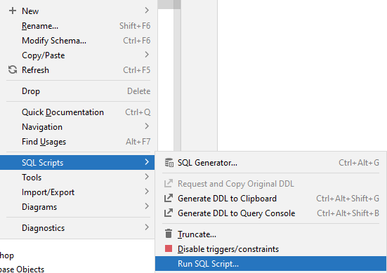

# Simple IMDb Exercises
In these exercises we will use a new data set about a subset if the IMDb database.

You must first import this data set. Download the ddl file from here:

[Simple IMDb ddl](IMDB_shows_DDL.sql)

You must import this by running the ddl code, like this:

Right click on your _schema_ folder, and select the "SQL Scripts" --> "Run SQL Script...".

This should import a new schema, the simple_imdb.

Then, you must import data. Download the data her:

[Simple IMDb data](https://drive.google.com/file/d/1QqTU-o-n-Fe4X9LoIhrJtLMNhlq7OQZH/view?usp=sharing)

And then run it, in the same way as before. You should now have a "simple_imdb" schema with data. Verify this.

The below is a Global Relations Diagram to get an overview of the database:

On the following slides, you will be asked questions, which must be answered by querying the simple_imdb database.\
All questions can be answered with a single sql statement (consider this a challange), but sometimes it is easier to do multiple statements.
For most questions, you can also find the answer as a hint. Do give it a serious try first, before you look at the answer. \
Proposed sql solutions are also available and are hidden as well.