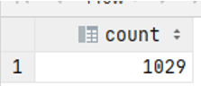

# Exercise 3

How many people has the name 'Jennifer'?

<details>
<summary>Show answer</summary>



</details>

<br/>

<details>
<summary>Show SQL</summary>

```sql
SELECT COUNT(*)
FROM people
WHERE name LIKE '%Jennifer%';
```

</details>