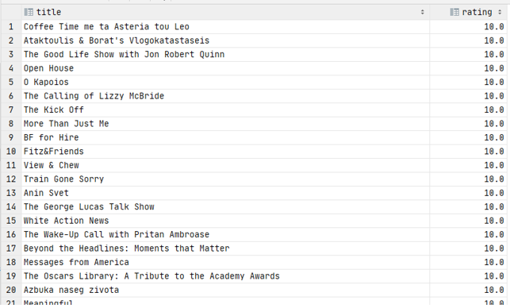

# Exercise 9

What is the title and rating of the highest rated show(s)?

<details>
<summary>Show answer</summary>



</details>

<br/>

<details>
<summary>Show SQL</summary>

```sql
SELECT title, rating
FROM ratings,
     shows
WHERE Show_id = id
  AND rating = (
      SELECT MAX (rating)
      FROM ratings
      )
;
```

</details>