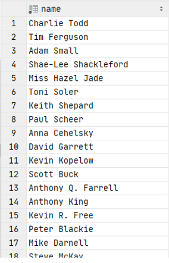

# Exercise 11

Which people are both stars and writers?

<details>
<summary>Show answer</summary>



</details>

<br/>

<details>
<summary>Show SQL</summary>

```sql
-- Use distinct to remove duplicate rows
SELECT DISTINCT name
FROM stars,
     writers,
     people
WHERE stars.person_id = id
  AND writers.person_id = id
;
```

</details>