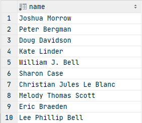

# Exercise 12

List the names of both stars and writers of 'The Young and the Restless

<details>
<summary>Show answer</summary>



</details>

<br/>

<details>
<summary>Show SQL</summary>

```sql
-- Didn't manage to make a join work
SELECT DISTINCT name
FROM people
-- This where finds filters by the people(id) being in a set
WHERE id IN (
-- This select find the stars (person_id) of the show with a specific id
    SELECT person_id
    FROM stars
    WHERE show_id = (
-- This select find the id of the show
        SELECT id
        FROM shows
        WHERE title = 'The Young and the Restless'
        )
    )
    OR id IN (
        SELECT person_id
        FROM writers
        WHERE show_id = (
            SELECT id
            FROM shows
            WHERE title = 'The Young and the Restless'
            )
        )
;
```

</details>